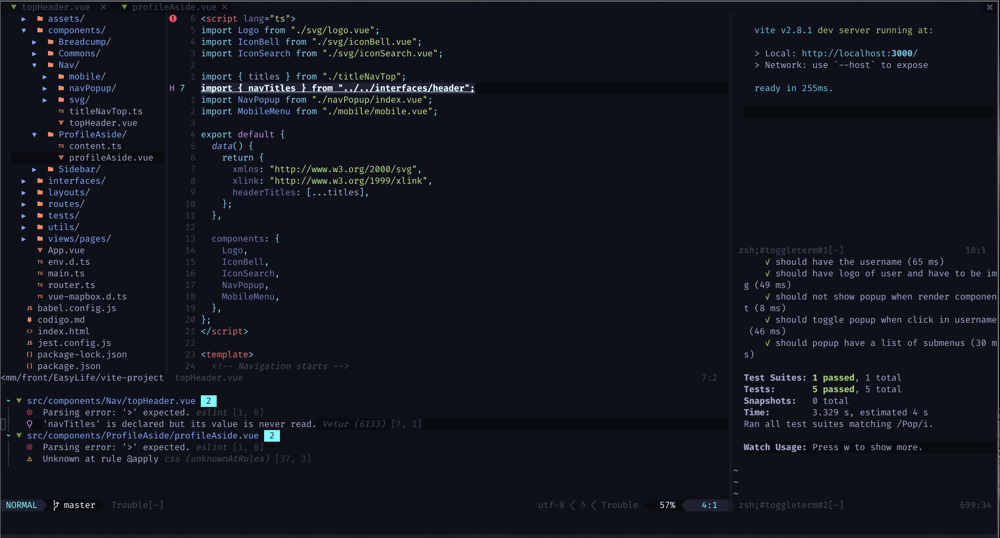

# neovim_config

 

This is Rafael's Neovim configuration. If you want to see how it's work and make some tests, clone this repo like this:

```bash
  git clone https://github.com/RafaelButler/neovim_config.git
```

And save your current Nvim folder with another name and replace it with was cloned.

---

## Package Manager

- [Packer nvim](https://github.com/wbthomason/packer.nvim) 

---

## Plugins

Here are some of the plugins used: 

- [Builting LSP](https://github.com/neovim/nvim-lspconfig) 
- [Null-ls](https://github.com/jose-elias-alvarez/null-ls.nvim) 
- [Treesitter](https://github.com/nvim-treesitter/nvim-treesitter) 
- [GitSigns](https://github.com/lewis6991/gitsigns.nvim) 
- [Cmp LSP](https://github.com/hrsh7th/nvim-cmp) 
- [Telescope](https://github.com/nvim-telescope/telescope.nvim) 
- [LuaLine](https://github.com/nvim-lualine/lualine.nvim) 
- [BufferLine](https://github.com/akinsho/bufferline.nvim) 
- [NvimComment](https://github.com/terrortylor/nvim-comment) 
- [Material Theme](https://github.com/kaicataldo/material.vim) 

---

## Extras

Remember this configuration is for my personal use. Feel free to adapt and edit for your specific need.
